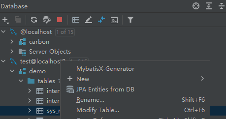

# spring security example
#  spring security+thymeleaf
启动后，在浏览器输入http://localhost:10000 ，会跳到登录页，默认用户名：user  密码会打印到控制台，

类似Using generated security password: f9a6b443-5a5b-4603-92e9-13756e401c6b

1.执行init.sql

2.在idea中生成代码





1.可以yaml文件配置用户名密码：

```yaml
spring:
    security:
        user:
            name: admin
            password: 123456
```